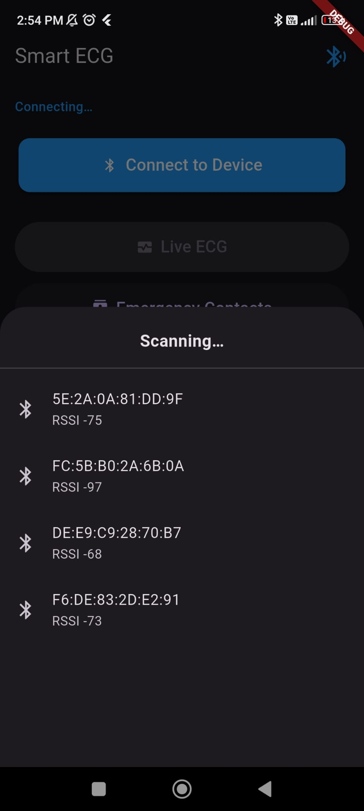
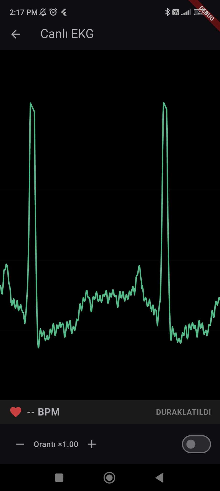
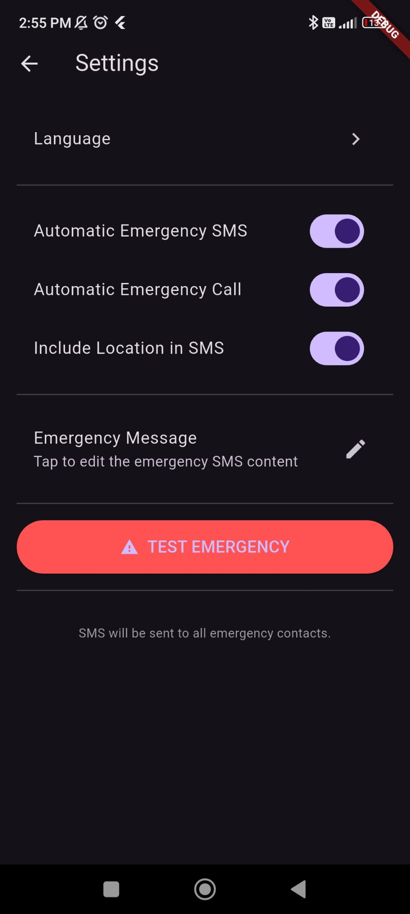
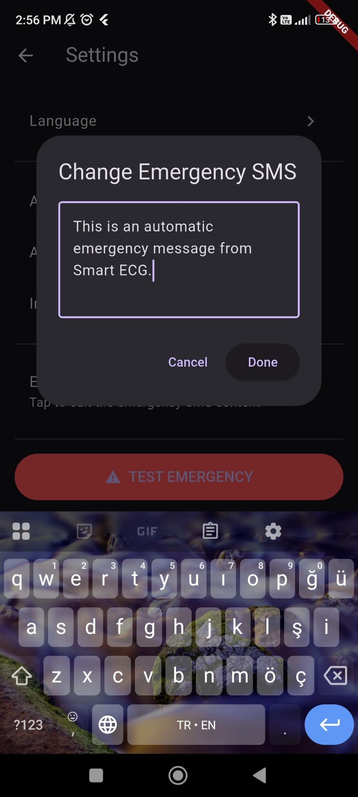
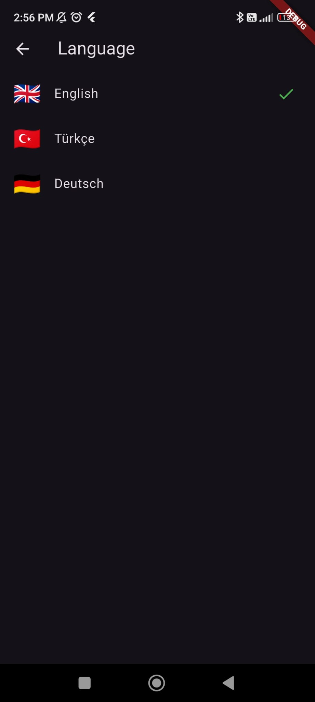
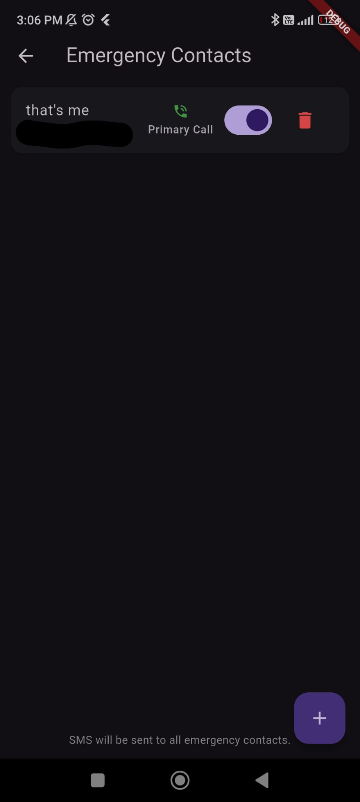
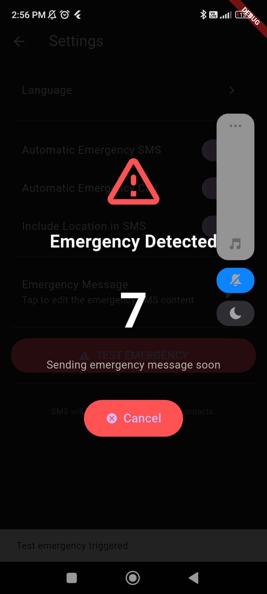
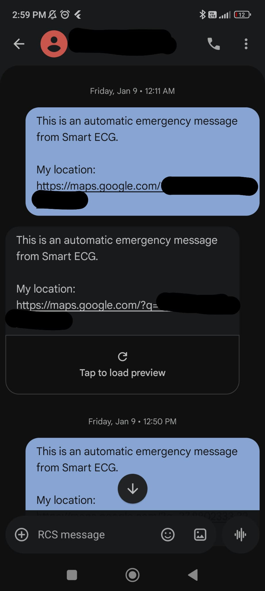
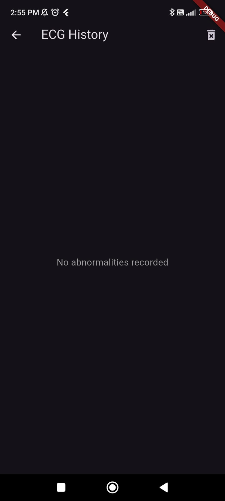

# Smart ECG Monitor

Real-time wearable ECG monitoring system with ESP32 firmware and Flutter mobile application.

## Overview

A portable ECG monitoring system that captures heart electrical activity in real-time using an AD8232 sensor module, processes the signal on an ESP32 microcontroller, and transmits data via Bluetooth Low Energy to a Flutter mobile application for visualization, analysis and emergency trigger.

## System Architecture
```
[Electrodes] → [AD8232] → [ESP32] → [BLE] → [Flutter App] → [SQLite DB]
     │              │          │                   │
   3-lead      Amplify &   500Hz ADC          Real-time
   Ag/AgCl      Filter     DC Removal          Graph &
                           R-Peak Detection    BPM Display
```

---

## 1. Firmware (ESP32)

### Features
- 500 Hz sampling rate with hardware timer interrupt
- Real-time DC offset removal using IIR high-pass filter
- Adaptive threshold R-peak detection for BPM calculation
- EMA smoothing for stable heart rate values
- Electrode lead-off detection with instant notification
- Modular architecture with 12 separate source files
- BLE GATT server with 3 characteristics (LIVE, CTRL, EVENT)

### Hardware Requirements
| Component | Description |
|-----------|-------------|
| ESP32 DevKit V1 | Dual-core 240MHz, WiFi/BLE, 320KB RAM |
| AD8232 | Single-lead ECG analog front-end module |
| Electrodes | 3x Ag/AgCl disposable electrodes (RA, LA, RL) |
| Power | 4 x 1.5 AA Alkaline battery |

### Pin Configuration
| ESP32 Pin | AD8232 Pin | Function |
|-----------|------------|----------|
| GPIO 32 | OUTPUT | Analog ECG signal input |
| GPIO 25 | LO+ | Lead-off detection (+) |
| GPIO 26 | LO- | Lead-off detection (-) |
| GPIO 27 | SDN | Shutdown control |
| 3.3V | 3.3V | Power supply |
| GND | GND | Ground reference |

### Software Architecture
```
firmware/
├── smart_ECG.ino        # Main orchestrator
├── config.h             # Central configuration
├── ring_buffer.h/cpp    # ISR-safe circular buffer
├── dc_removal.h/cpp     # DC offset filter
├── peak_detector.h/cpp  # R-peak & BPM detection
├── ble_ecg.h/cpp        # BLE GATT server
└── ad8232.h/cpp         # Sensor interface
```

### Signal Processing Pipeline
```
Timer ISR (500Hz)
      │
      ▼
┌─────────────┐    ┌─────────────┐    ┌─────────────┐    ┌─────────────┐
│  ADC Read   │───▶│ Ring Buffer │───▶│  DC Removal │───▶│ Peak Detect │
│  (12-bit)   │    │   (4096)    │    │             │    │ (Adaptive)  │
└─────────────┘    └─────────────┘    └─────────────┘    └──────┬──────┘
                                                                │
                                                                ▼
                                                         ┌─────────────┐
                                                         │   BLE TX    │
                                                         │ (25 pkt/s)  │
                                                         └─────────────┘
```

### BLE Protocol
| Characteristic | Description |
|-----------------------------|
| LIVE | ECG data stream (20 samples/packet, 40 bytes) |
| CTRL | Commands (0x11=start, 0x12=stop) & status notifications |
| EVENT | Emergency Trigger Notify & Emergency history transfer (future feature) |

### Build & Upload
```bash
# 1. Install Arduino IDE 2.x
# 2. Add ESP32 board manager URL:
#    https://raw.githubusercontent.com/espressif/arduino-esp32/gh-pages/package_esp32_index.json
# 3. Install ESP32 Arduino Core v2.0.14
# 4. Open firmware/smart_ECG.ino
# 5. Select board: ESP32 Dev Module
# 6. Select port and upload
```

---

## 2. Mobile Application (Flutter)

### Features
- Real-time ECG waveform visualization
- Live BPM display with signal quality indicator
- BLE device scan and connection with automatic reconnection
- Background service for app to keep running
- Emergency event detection
- SQLite database for event history & emergency contacts.
- Emergency SMS with GPS location
- Multi-language support
- Alarm and vibration alerts

### Screenshots from the app
<p align="center">
  
  
  
</p>

<p align="center">
  
  
  
</p>

<p align="center">
  
  
  
</p>

### Tech Stack
- Flutter 3.38.4 / Dart 3.10.3
- flutter_riverpod - State management
- flutter_blue_plus - BLE communication
- drift - SQLite database
- geolocator - GPS location
- audioplayers - Alarm sounds
- vibration - Haptic feedback
- permission_handler - Runtime permissions
- flutter_background - Background service

### Project Structure
```
mobile/smart_ecg_app/lib/
├── app/                    # App configuration, routing, entry point
├── core/
│   ├── background/         # Background service management
│   ├── localization/       # Multi-language support (EN/TR)
│   ├── location/           # GPS location services
│   └── permission/         # Runtime permission handling
├── data/
│   └── database/           # Drift SQLite setup & DAOs
├── features/
│   ├── ble/                # BLE connection & communication
│   ├── ecg/                # ECG data processing & models
│   ├── emergency/
│   │   └── service/        # Emergency detection & SMS alerts
│   └── integration/        # Feature coordination layer
└── ui/
    ├── actions/            # User action handlers
    ├── screens/            # Full page UI screens
    └── widgets/            # Reusable UI components
└── pubspec.yaml            # Dependencies
```

### Build & Run
```bash
cd mobile/smart_ecg_app
flutter pub get
flutter run

# Build release APK
flutter build apk --release
```

---

## Demo

[Coming Soon]

---

## Future Improvements
- Automatic arrhythmia detection
- Cloud sync for remote monitoring
- iOS support
- Historical trend analysis
- PDF report generation

## Concerns & Notes to Myself
This is a student project that is not usable for medical purposes.
This project is done under a short time, started with zero mobile app experience so the code is not really clean and maintainable.
When you revisit and enhance this project, consider refactoring the mobile app to (data-domain-presentation) structure.
Learn more about ECG signal in medical terms, the frequency heart provides the signal etc.

---

## Author

**Furkan Şafak** - [GitHub](https://github.com/furkandawn)